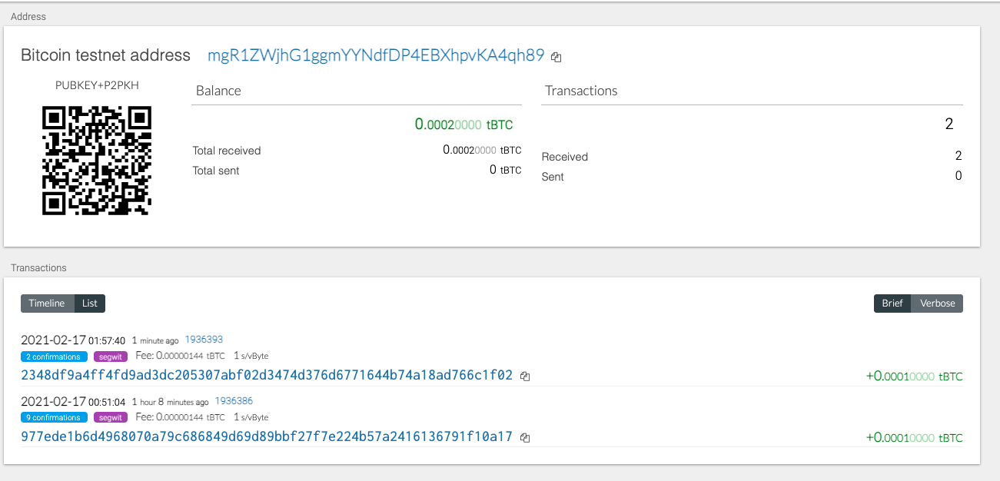

# Homework 19 Blockchain-Python

## Wallet Creation
For this homework we were asked to create a wallet with a master key that can be used across multiple blockchains. We used the BIP39 (Mnemonic Phase) to create a master key from which we could derive multiple keys. When you enter your mnemonic phrase, a dictionary of addresses, public and private keys are created which can be used to conduct crypto currency transactions.

## Installations
In oder to make it work, the following needs to be installed in the wallet directory:
- Install Homebrew and install the latest version of php with brew install php@7.3
- Clone the hd-wallet-derive tool
- Create a symlink called derive for the hd-wallet-derive/hd-wallet-derive.php script into the top level   project directory

I was unable to complete most of this homework assignment; however I am includeing screenshots of showing that I used a bitcoin faucet to fund an address. 